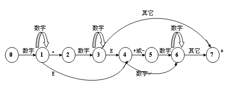

# 编译器

## 原理

### 词法分析器

* 通用数字（12.13e-1）的状态转移图

* 正负号和加减运算符的区分

当且仅当符号+|-的后一位为数字时，符号可能为正负号； 如果数字前一个字符串具有可被加减的性质，则是运算符加减；否则是正负号

## 完成进度
* 2016/11/26 词法分析程序，完成大部分简单的功能
* 2016/11/27 添加对通用数字的处理（12.13e-1）；添加正负号处理的逻辑；将不含正负号的纯数字处理封装成函数；error函数修改；其他相应修改 [未经测试有bug]
* 2016/11/28 修复bug

## 项目说明
1. 使用vs2015编译