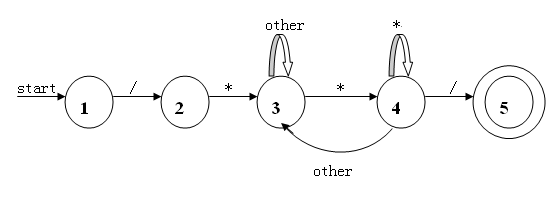
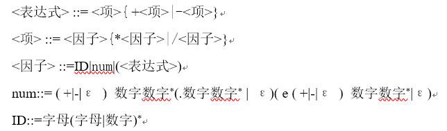

# 编译器

## 原理

### 词法分析器

* 通用数字（12.13e-1）的状态转移图

* 正负号和加减运算符的区分

当且仅当符号+|-的后一位为数字时，符号可能为正负号； 如果数字前一个字符串具有可被加减的性质，则是运算符加减；否则是正负号

* 注释的状态转移图

* 表达式的语法定义

## 完成进度
* 2016/11/26 词法分析程序，完成大部分简单的功能
* 2016/11/27 添加对通用数字的处理（12.13e-1）；添加正负号处理的逻辑；将不含正负号的纯数字处理封装成函数；error函数修改；其他相应修改 [未经测试有bug]
* 2016/11/28 修复bug
* 2016/11/30 对输入预处理（去除多余空格，Tab字符，回车换行符和注释）；读取多行输入；修复一些bug
* 2016/12/05 开始尝试理解并实现递归下降分析法和预测分析法
* 2016/12/06 理清逻辑，决定使用预测分析法编写语法分析程序；更改项目的代码组织形式
* 2016/12/07 改写词法分析的逻辑，实现对表达式的语法分析

## 项目说明
1. 使用vs2015编译
2. 由于水平有限，C与C++风格混杂